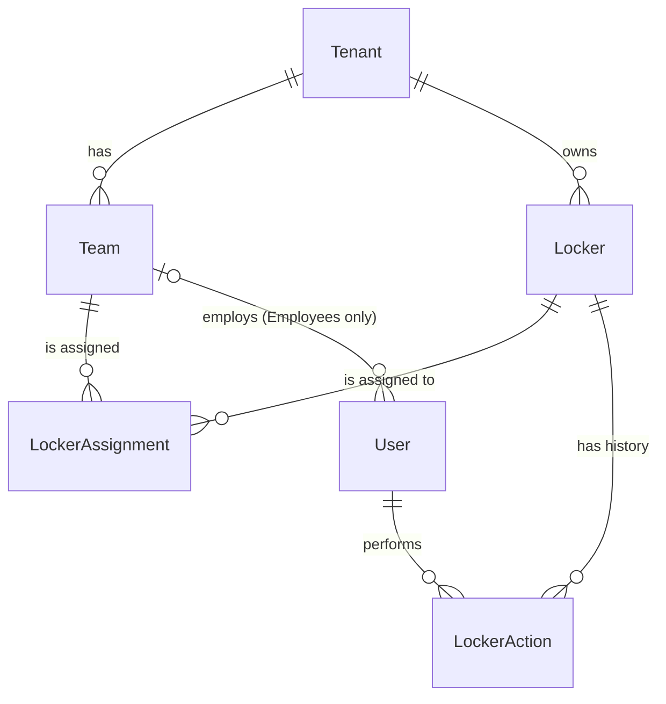

# eLocker Platform

A multi-tenant smart-locker platform, built for the [test assignment brief](eLocker_Test_Assignment_Locker_Platform.md). Tenants' Employees open and close their Team's Lockers, and eLocker's Support Engineers can open and close every Locker on the platform. Each Tenant sees only its own data, and the server enforces this on every query and action.

The domain terms (Tenant, Team, Employee, Support Engineer, Locker Assignment, Accessible Lockers and so on) are defined in the glossary, [CONTEXT.md](CONTEXT.md).

## How to run

Prerequisites: Ruby 3.2.6 and Bundler. SQLite is bundled with the `sqlite3` gem.

| Step | Command |
| --- | --- |
| Install gems, create and seed the database, start the server | `bin/setup` |
| Set up only, without starting the server | `bin/setup --skip-server` |
| Start the server | `bin/dev`, then open http://localhost:3000 |
| Reset the demo data | `bin/rails db:reset` (or `bin/rails db:seed`, which is idempotent) |
| Run the tests | `bundle exec rspec` |
| Lint | `bin/rubocop` |

There is no login. Use the **Acting as** dropdown in the header to switch the current User. The first User, Sam (Support Engineer), is selected by default.

## Walkthrough

The seed data has two Tenants, five Teams with one Employee each, and two Support Engineers:

| User | Team | Lockers |
| --- | --- | --- |
| Alice (Amazon · Berlin Morning) | Berlin Morning | BER-1, BER-2 |
| Bob (Amazon · Berlin Night) | Berlin Night | BER-1, BER-3 |
| Carol (Amazon · Munich) | Munich | MUC-1 |
| Dave (DPD · Hamburg) | Hamburg | HAM-1, HAM-2 |
| Erin (DPD · Cologne) | Cologne | CGN-1 |
| Sam (Support Engineer), Kim (Support Engineer) | none | all 8 Lockers |

The Locker ids below assume a freshly reset database (`bin/rails db:reset`): BER-1 is 1, BER-2 is 2, BER-3 is 3, MUC-1 is 4, HAM-1 is 5, HAM-2 is 6, HAM-3 is 7, CGN-1 is 8.

1. **An Employee's scoping.** Switch to Alice. The Lockers list shows only BER-1 and BER-2, without a Tenant column. The Action Log shows only actions on those two Lockers.
2. **A shared Locker.** Switch to Bob. He sees BER-1 and BER-3, but not BER-2. In his Action Log, he sees Alice's actions on BER-1, because their Teams share it, but none of her actions on BER-2. The BER-1 page lists both Teams.
3. **A 404 by URL guessing.** As Alice, open http://localhost:3000/lockers/5 (HAM-1, DPD's), then /lockers/3 (BER-3, Bob's Team's) and /lockers/999 (missing). All three show the same "Not found" page, with status 404, inside the app, so you can switch User from it. An open or close request for another Team's Locker also answers 404 and changes nothing. To try it, use the browser's developer tools to change a button's form `action` from `/lockers/1/locker_actions` to `/lockers/5/locker_actions`, then click it.
4. **A Support Engineer's full view.** Switch to Sam. The Lockers list shows all 8 Lockers with a Tenant column, and Sam can open and close any of them. The Action Log shows all 15 seeded actions with Tenants and real names.
5. **The unassigned Locker.** HAM-3 belongs to DPD but has no Locker Assignment. Sam and Kim see it and its history. Dave, a DPD Employee, doesn't: /lockers/7 answers 404 for him.
6. **Open/close rejection.** As Alice, open the Lockers list in two tabs. Close BER-1 in the first tab. Then click the stale **Close** button in the second tab. The request is rejected with "BER-1 is already closed.", and no Locker Action is recorded.
7. **Anonymised support actions.** Sam opened or closed BER-1 once, and Kim did the same with HAM-1. As Alice or Bob, the BER-1 entry by Sam shows **eLocker Support**. As Dave, the HAM-1 entry by Kim does too. Switch to Sam and the same entries show the real names.

## Data model

- **Tenant**: a customer company such as Amazon or DPD. Owns Teams and Lockers.
- **Team**: belongs to one Tenant.
- **User**: has a `role`, either `employee` or `support_engineer`. An Employee belongs to exactly one Team. A Support Engineer belongs to no Team. A model validation and a database CHECK constraint both enforce this.
- **Locker**: a single door, owned by one Tenant. Its `state` is `open` or `closed` (also a CHECK constraint).
- **Locker Assignment**: the join between a Team and a Locker of the same Tenant.
- **Locker Action**: a record that a User opened or closed a Locker, and when. It is read-only once recorded, in the model and the database. It exists only if the Locker State actually changed.

### Why it looks like this

- **Locker Assignments are many-to-many.** The brief says that each Team works with "its own set" of Lockers. Teams such as a morning and a night shift naturally share the same physical Locker. A `team_id` on `lockers` would rule that out, so a join table it is. The seeds show it with BER-1.
- **Users have no Tenant reference.** An Employee's Tenant is a property of their Team. Storing it on the User as well would create a second source of truth that could drift. A Support Engineer has no Tenant at all, because eLocker is not a Tenant. See [ADR 0001](docs/adr/0001-tenant-consistency-via-composite-foreign-keys.md).
- **The brief's "company" is called "Tenant".** It is the unit of data separation, and the name says so. "Company" is ambiguous here, because eLocker is a company too but is not a Tenant. The glossary in [CONTEXT.md](CONTEXT.md) lists the terms to use and to avoid.
- **The database guarantees tenant consistency, not just the models.** A Locker Assignment carries a deliberately duplicated `tenant_id`. Composite foreign keys on it make it impossible to assign one Tenant's Locker to another Tenant's Team, even through raw SQL or the console ([ADR 0001](docs/adr/0001-tenant-consistency-via-composite-foreign-keys.md)). A trigger rejects a Locker Action by an Employee on another Tenant's Locker ([ADR 0002](docs/adr/0002-tenant-consistency-of-locker-actions-via-trigger.md)). A Locker or Team never changes Tenant, and a recorded Locker Action never changes, so history can't move to another Tenant ([ADR 0003](docs/adr/0003-a-locker-or-team-never-changes-tenant.md)). Because of the triggers, the schema is dumped as `db/structure.sql`.
- **Opening or closing creates a Locker Action.** `POST /lockers/:locker_id/locker_actions` with `kind=open|close` is the only write endpoint. `Locker#operate` checks the State, creates the Locker Action and changes the State in one transaction under `with_lock`, which on SQLite takes the database write lock. Two simultaneous requests therefore produce at most one change.

## Access design

- **One rule: Accessible Lockers.** [`Locker.accessible_by(user)`](app/models/locker.rb) returns every Locker for a Support Engineer and the Team's assigned Lockers for an Employee. Every controller loads Lockers through it: the Lockers list, the Locker page, open/close, and the Action Log, which is `LockerAction.where(locker: accessible_lockers)`. Tenant separation follows from tenant-consistent Locker Assignments, so there is no second Tenant check to keep in sync.
- **404, not 403.** A Locker outside the rule is loaded with `accessible_lockers.find(id)`, which raises "not found" just like a missing id. A 403 would confirm to another Tenant's Employee that the Locker exists. Ids are sequential, so it would also let them count it.
- **No authorization gem.** Seeing a Locker always means being able to operate it, so one scope answers every question the app asks. Pundit or CanCanCan would wrap that same scope in a policy class and add a layer with nothing to decide. A gem becomes worth it once permissions differ per action, for example with read-only roles.
- **Hiding Support Engineers' names is presentation, not access.** Employees see the actions of Support Engineers on their Lockers, so that the history matches the Locker State, but the name is shown as "eLocker Support" ([`actor_name`](app/helpers/locker_actions_helper.rb)).
- **Every rule has a request spec that fails if the rule is removed**, at the HTTP seam ([spec/requests](spec/requests)). Rules that only the console can break are covered by model specs that also write past the model to hit the database constraint ([spec/models](spec/models)).

## Assumptions

- **A Tenant may exist without Teams**, for example during onboarding. Its Lockers are visible only to Support Engineers until a Team is assigned.
- **A Locker is a single door**, with no compartments, and its only states are Open and Closed.
- **Seeing means operating.** There are no read-only Users.
- **History access follows current Locker access.** If a Team loses a Locker Assignment, its Employees also lose that Locker's past actions from their Action Log, including their own.

## Questions for the business

- Do Lockers have **compartments** that open separately? That would turn a Locker into a parent of Compartments, each with its own State and history.
- Are there **read-only roles**, such as a supervisor who watches but doesn't open? That would split Accessible Lockers into "can see" and "can operate".
- Should Employees see **which Support Engineer** acted, or is "eLocker Support" right?
- Do **contractors work across Tenants**, or across several Teams? Today a User has one Team. Multiple memberships would turn that reference into a join table.
- Should a Team keep the **history of a Locker after losing its Locker Assignment**? Today it doesn't.
- Can a Locker **pass to another Tenant**, for example when it is resold? Its history travels with the Locker, so the new Tenant would see the old Tenant's Locker Actions. The app therefore never moves a Locker or Team to another Tenant ([ADR 0003](docs/adr/0003-a-locker-or-team-never-changes-tenant.md)): a transfer means creating a new Locker. If transfers are real, each Locker Action would have to record its Tenant, and history would be filtered by it.

## Next steps

- **Live updates.** Broadcast State changes with Turbo Streams, so that a list open in another browser doesn't show a stale button.
- **Read-only roles**, if the business wants them, which is when an authorization layer would start to pay off.
- **Action Log filters**, by Locker, kind, User and date range.
- **Real authentication** in place of the mocked user switcher, for example with the Rails 8 authentication generator.

## How AI tools were used

I worked with Claude Code throughout. The decisions and architecture are mine. AI was used to challenge and implement them:

- **Design.** I used AI to question my plans about the data model and the access rules. The outcomes were recorded as the glossary in [CONTEXT.md](CONTEXT.md) and the ADRs in [docs/adr](docs/adr).
- **Planning.** The spec is GitHub issue #1, split into one issue per vertical slice (#2 to #8). Each slice landed as its own pull request.
- **Implementation.** AI wrote code test-first against the request-spec seam agreed in the spec. [CLAUDE.md](CLAUDE.md) carries the project's conventions: Rails way, YAGNI, KISS, DRY, RSpec with FactoryBot.
- **Review.** AI reviewed each slice against its issue and the conventions, and I reviewed the code before merging. The smaller commits that follow each feature commit came from those reviews.
